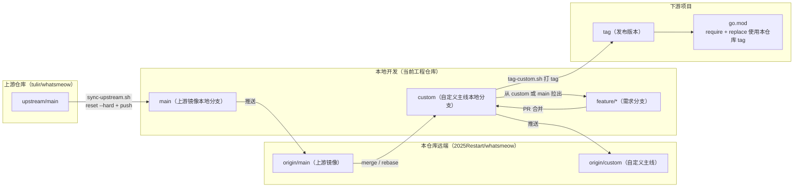

## 一、背景说明

本仓库 `2025Restart/whatsmeow` 基于上游开源项目 [`tulir/whatsmeow`](https://github.com/tulir/whatsmeow) 的 `main` 分支 fork 而来，用于在保持上游能力的前提下，增加本方的定制功能。  
本仓库的默认假设：

- 自定义需求 **通常不会** 以 PR 形式合并回上游；
- 需要能够长期、低成本地同步上游更新；
- 对下游使用方提供稳定、可追踪的版本（通过 tag）。

为此，本仓库采用「**上游镜像分支 + 自定义主线分支**」的分支策略，并配套简单脚本减少日常操作成本。

---

## 二、远端与分支约定

- **远端**
  - `origin`：本仓库远端  
    - 地址示例：`https://github.com/2025Restart/whatsmeow`
  - `upstream`：上游官方仓库  
    - 地址：`https://github.com/tulir/whatsmeow`

- **本地分支角色**
  - `main`
    - 永远作为 **上游 `main` 的纯镜像分支**。
    - 不在此分支上做任何定制开发。
    - 通过脚本或命令 `reset --hard` 到 `upstream/main`，再强制推送到 `origin/main`。
  - `custom`
    - **自定义主线 / 发行分支**。
    - 所有不会 PR 上游的自定义改动，最终都合并到 `custom`。
    - 对下游项目，一般从 `custom` 打 tag 作为依赖版本。
    - 建议在 GitHub 上对 `custom` 开启分支保护：只能通过 PR 合并、禁止删除、限制 push。
  - `feature/*`
    - 针对单一需求或问题的短生命周期分支，例如：`feature/add-xxx-support`。
    - 开发完成后，通过 PR 合并回 `custom`，便于代码评审与历史追溯。

> 建议：将 `custom` 视为「公司自己的主分支」，将 `main` 视为「官方只读镜像」。

---

## 三、Git Flow 流程图



---

## 四、同步上游 `main` 的流程

### 4.1 首次配置 `upstream`

在本仓库根目录执行一次：

```bash
git remote add upstream https://github.com/tulir/whatsmeow.git
```

如已存在 `upstream`，可用：

```bash
git remote set-url upstream https://github.com/tulir/whatsmeow.git
```

### 4.2 使用脚本同步上游：`sync-upstream.sh`

根目录提供脚本 `sync-upstream.sh`，用于在本地快速完成：

- 确认/配置 `upstream` 远端；
- 拉取最新上游代码；
- 将本地 `main` 重置为 `upstream/main`；
- 将 `main` 以 `--force-with-lease` 推送到 `origin/main`。

**前置约束：**

- 当前工作区必须干净：没有未提交修改或未跟踪文件；
- 本地必须已有 `main` 分支；
- 该脚本只操作 `main` 分支，不会自动处理 `custom`。

**使用示例：**

```bash
./sync-upstream.sh
```

完成后，`origin/main` 将与上游 `tulir/whatsmeow` 的 `main` 完全对齐。  
后续需要手动将更新合并或变基到 `custom`（见下一节）。

### 4.3 手动同步命令（应急用）

若不使用脚本，可按以下步骤手工同步：

```bash
git fetch upstream
git checkout main
git reset --hard upstream/main
git push origin main --force-with-lease
```

> 注意：`git reset --hard` + `--force-with-lease` 会重写 `main` 历史，**不要** 在 `main` 上做任何仅存在于本仓库的改动，否则会丢失。

---

## 五、将上游更新合入自定义主线 `custom`

在完成「上游 → main」同步后，需要把变更纳入自定义主线 `custom`。

常用有两种方式：**merge** 与 **rebase**，团队可按习惯选择其一。

### 5.1 基于 merge 的推荐流程（默认）

```bash
git checkout custom
git fetch origin        # 获取最新 main/custom
git merge origin/main   # 将 main 的更新合并到 custom
```

- 若无冲突，直接生成一个 merge commit。
- 若有冲突：
  - 按文件逐个解决；
  - `git add <文件>` 标记已解决；
  - `git commit` 完成合并。

完成后：

```bash
git push origin custom
```

### 5.2 基于 rebase 的流程（可选）

```bash
git checkout custom
git fetch origin
git rebase origin/main
```

- 会将 `custom` 上的提交「重放」在 `main` 最新提交之后；  
- 历史更线性，但冲突解决过程可能更复杂。

完成后同样需要：

```bash
git push origin custom
```

> 建议：如果团队对 rebase 不熟悉，日常以 **merge 为主**，仅在需要特别整洁历史时使用 rebase。

### 5.3 冲突处理原则

当 `custom` 中的自定义改动与上游更新产生冲突时，建议遵循：

- **优先保证协议/安全/兼容性相关逻辑保持上游行为**；
- 必要时将自定义行为封装到：
  - 参数/配置项；
  - 独立函数或适配层；
  - 条件分支（带清晰注释说明「此为定制行为」）。

避免对上游核心逻辑做大范围重写，以减轻后续更新成本。

---

## 六、自定义需求开发流程

### 6.1 从哪里拉特性分支

- 若新需求与既有定制无强依赖，且希望与上游保持更近：
  - 从 `main` 拉分支：
    ```bash
    git checkout main
    git checkout -b feature/<name>
    ```
- 若新需求强依赖已有自定义逻辑：
  - 从 `custom` 拉分支：
    ```bash
    git checkout custom
    git checkout -b feature/<name>
    ```

### 6.2 开发过程中的更新

开发周期稍长时，建议定期与基准分支同步，避免一次性冲突过大：

```bash
git fetch origin
git rebase origin/main    # 基于 main 开发时
# 或
git rebase origin/custom  # 基于 custom 开发时
```

### 6.3 合并回 `custom`

需求开发与自测完成后，将 `feature/*` 分支合并到 `custom`。推荐使用 PR 方式，便于代码评审与记录：

```bash
git checkout custom
git merge --no-ff feature/<name>   # 或在 GitHub 上使用 squash merge
git push origin custom
```

> 建议：所有改动通过 PR 合并到 `custom`，并在 GitHub 上对 `custom` 启用分支保护（要求 PR、禁止删除、限制直接 push）。

---

## 七、下游项目在 `go.mod` 中的使用方式

假设原模块路径为：`go.mau.fi/whatsmeow`，下游已有对上游官方的依赖：

```go
require go.mau.fi/whatsmeow vX.Y.Z
```

### 7.1 使用本仓库的自定义版本

推荐在 `custom` 分支上为稳定版本打 tag，例如：`v0.0.1-custom.20251222`。  
下游项目的 `go.mod` 可配置为：

```go
require go.mau.fi/whatsmeow v0.0.1-custom.20251222

replace go.mau.fi/whatsmeow => github.com/2025Restart/whatsmeow v0.0.1-custom.20251222
```

说明：

- `require` 保持使用原始模块路径 `go.mau.fi/whatsmeow`，便于将来需要回切官方版本时，仅修改 `replace` 即可；
- `replace` 将依赖导向本仓库，并固定在指定 tag 上，避免直接依赖浮动分支。

### 7.2 本地开发/调试

下游项目在本地联调时，可以将依赖指向本机路径：

```go
replace go.mau.fi/whatsmeow => /Users/xxx/path/to/whatsmeow
```

> 不建议将本地路径形式的 `replace` 提交到远程仓库，可通过本地分支或个人配置管理。

---

## 八、在 `custom` 分支打 tag 的约定

为便于下游定位具体版本，本仓库提供脚本 `tag-custom.sh`，用于在 `custom` 分支安全打 tag 并推送。

约定如下：

- 仅在 `custom` 分支上打 tag；
- 打 tag 前，`custom` 分支应已同步最新 `origin/custom`；
- tag 命名建议：
  - `vX.Y.Z-custom.YYYYMMDD`，或
  - `custom-YYYYMMDD-HHMM-<short-sha>`。

具体脚本使用方式见下一节。

---

## 九、脚本使用说明

### 9.1 同步上游脚本：`sync-upstream.sh`

用途：在本地快速将 `upstream/main` 同步到 `origin/main`，保持 `main` 为上游镜像。

主要行为：

- 检查当前仓库状态是否干净；
- 确认/配置 `upstream` 远端；
- `git fetch upstream`；
- 切换到 `main` 分支（要求本地已经存在该分支）；
- `git reset --hard upstream/main`；
- 使用 `git push origin main --force-with-lease` 将更新推到远程。

使用前建议将脚本设为可执行：

```bash
chmod +x sync-upstream.sh
```

使用示例：

```bash
./sync-upstream.sh
```

脚本执行完成后，会在终端提示如何将更新合入 `custom`。

### 9.2 自定义主线打 tag 脚本：`tag-custom.sh`

用途：在本地 `custom` 分支上安全地创建并推送 tag。

主要行为与保护：

- 要求工作区干净（无未提交修改或未跟踪文件）；
- 要求当前分支为 `custom`；
- 要求本地 `custom` 与 `origin/custom` 一致；
- 支持：
  - 通过参数指定 tag 名称：`./tag-custom.sh v0.0.1-custom.20251222`；
  - 未传参时自动按约定生成一个 tag 名（基于日期和当前提交短 SHA）；
- 检查 tag 是否已存在，已存在则退出；
- 创建带信息的 tag，并推送到 `origin`。

同样建议先设为可执行：

```bash
chmod +x tag-custom.sh
```

使用示例：

```bash
# 自动生成 tag 名
./tag-custom.sh

# 手工指定 tag 名
./tag-custom.sh v0.0.1-custom.20251222
```

---

## 十、GitHub 分支保护建议

在 GitHub 仓库 `2025Restart/whatsmeow` 中，建议进行如下保护配置：

- 对 `custom` 分支：
  - 启用 Branch protection rule，匹配分支名 `custom`；
  - 启用：
    - Require a pull request before merging；
    - （可选）Require status checks to pass before merging（如有 CI）；
    - Restrict who can push to matching branches（限制少数维护者或机器人）；
    - Prevent deletion（禁止删除分支）。
- 对 `main` 分支：
  - 至少启用 Prevent deletion（避免误删）；
  - 建议限制大部分人直接 push，仅允许少数维护者执行同步脚本所需的推送（包括 force push）。

通过上述保护，可以保证：

- 自定义主线 `custom` 的修改流程清晰、可审计；
- 上游镜像 `main` 不被误删，但仍然可以由维护脚本安全地重置与推送。

---

## 十一、常见问题

- **Q：`sync-upstream.sh` 提示工作区不干净怎么办？**  
  A：请先执行 `git status`，确认所有修改已通过 `git commit` 或使用 `git stash` 暂存，再重新运行脚本。

- **Q：更新上游后，`custom` merge/rebase 时冲突太多怎么办？**  
  A：优先处理协议/安全敏感文件，必要时可以将自定义逻辑提取到独立函数、配置开关或包装层，减少与上游直接冲突的区域。

- **Q：下游项目更新 tag 后需要做什么？**  
  A：更新 `go.mod` 中的 `require` 与 `replace` 版本号，然后执行 `go mod tidy`，再重新构建/测试。

- **Q：是否可以直接依赖某个分支（如 `custom`）而不是 tag？**  
  A：不建议。直接依赖分支会导致构建结果随分支变化而漂移，难以排查问题，推荐始终依赖 tag 或固定 commit。


